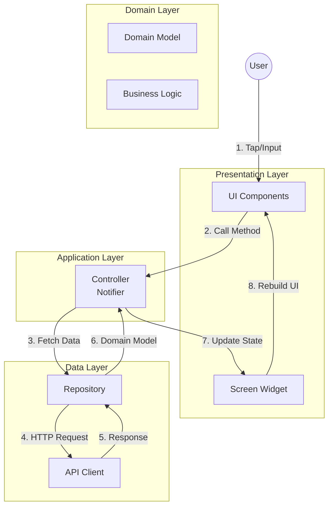

# 01. Architecture & Directory Structure

## 1. 概要 (Overview)

本プロジェクトは、**Feature-First (機能優先)** のディレクトリ構成を採用したFlutterアプリケーションです。
機能の分類は「ユーザーが見る画面」ではなく、**「ユーザーが行うこと（ドメイン）」**に基づいて行います。

バックエンドに **BFF (Backend For Frontend / Laravel)** が存在することを前提とし、クライアントサイドでの複雑なデータ変換を避け、UI構築と状態管理に注力します。

### 技術スタック (Tech Stack)

| Category | Tech | Description |
| :--- | :--- | :--- |
| **Framework** | Flutter | クロスプラットフォームUIフレームワーク |
| **State Mngt** | Riverpod | `Notifier` / `AsyncNotifier` (Generator使用推奨) |
| **Routing** | GoRouter | URLベースの宣言的ルーティング |
| **HTTP Client** | Dio + Retrofit | 型安全なAPIクライアント |
| **Data Class** | Freezed | イミュータブルなデータモデル |

---

## 2. ディレクトリ構成 (Directory Structure)

Feature-Firstアプローチでは、**機能ごとにフォルダを作成し、その中に各レイヤーを配置**します。

```text
lib/
├── src/
│   ├── common_widgets/       # 【共通UI】複数機能で共有するウィジェット
│   │   ├── buttons/          # ボタン類
│   │   ├── inputs/           # 入力フィールド
│   │   └── layouts/          # 共通レイアウト枠
│   │
│   ├── constants/            # 【定数】アプリ全体で使用する定数
│   │   ├── app_sizes.dart    # サイズ定数
│   │   └── api_endpoints.dart # APIエンドポイント
│   │
│   ├── exceptions/           # 【例外】アプリ全体の例外クラス
│   │   └── app_exception.dart
│   │
│   ├── features/             # 【機能モジュール】ドメインごとの縦割り
│   │   ├── authentication/
│   │   │   ├── data/         # データ層: Repository実装、API通信
│   │   │   ├── domain/       # ドメイン層: モデル、ビジネスロジック
│   │   │   ├── application/  # アプリケーション層: サービス、状態管理
│   │   │   └── presentation/ # プレゼンテーション層: ウィジェット、画面
│   │   ├── products/
│   │   │   ├── data/
│   │   │   ├── domain/
│   │   │   ├── application/
│   │   │   └── presentation/
│   │   ├── cart/
│   │   ├── checkout/
│   │   ├── orders/
│   │   └── reviews/
│   │
│   ├── localization/         # 【国際化】多言語対応
│   ├── routing/              # 【ルーティング】GoRouter定義
│   ├── theme/                # 【テーマ】デザイン定義
│   └── utils/                # 【ユーティリティ】ヘルパー関数
│
├── app.dart                  # MaterialApp
└── main.dart                 # Entry Point
```

---

## 3. Feature-First の重要原則

### 3.1. 機能の定義方法

**最重要**: 機能は「ユーザーが見るもの（UI）」ではなく、「ユーザーが行うこと（ドメイン）」に基づいて定義します。

#### ❌ 悪い例: UIベースの分類

```text
features/
  ├── product_page/          # 商品ページ
  ├── products_list/         # 商品一覧
  └── leave_review_page/     # レビュー投稿ページ
```

この分類では、関連するロジックが複数のフォルダに分散し、保守性が低下します。

#### ✅ 良い例: ドメインベースの分類

```text
features/
  ├── products/              # 商品の管理と表示
  ├── reviews/               # レビュー機能
  └── authentication/        # 認証
```

この分類では、関連するコード（モデル、ロジック、UI）が1つのフォルダに集約されます。

### 3.2. Feature-First の利点

1. **コロケーション**: 関連ファイルが1つのフォルダに集約される
2. **削除の容易さ**: 機能削除時にフォルダごと削除でき、漏れが少ない
3. **スケーラビリティ**: アプリが成長しても管理が容易
4. **バランス**: 各フォルダサイズが比較的均等に保たれる

---

## 4. 各層の役割 (Layer Responsibilities)

各`features/`配下の機能フォルダには、**4つのレイヤー**を配置します。

### 4.1. Data Layer (`data/`)

**役割**: 外部データソース（API、データベース）とのやり取り

```text
features/products/data/
  ├── product_repository.dart      # Repository実装
  ├── product_api_client.dart      # API通信 (Retrofit)
  └── mock_product_repository.dart # Mock実装
```

**責務**:
- APIクライアント（Retrofit）の定義
- Repositoryパターンの実装
- Mock/Real の切り替えロジック
- データの取得・保存・更新・削除

### 4.2. Domain Layer (`domain/`)

**役割**: ビジネスロジックとデータモデルの定義

```text
features/products/domain/
  ├── product.dart                 # ドメインモデル (Freezed)
  ├── product.freezed.dart         # 生成ファイル
  ├── product.g.dart               # 生成ファイル
  └── product_validation.dart      # ビジネスロジック（検証など）
```

**責務**:
- ドメインモデルの定義（Freezed使用）
- ビジネスルールの実装
- バリデーションロジック
- フレームワーク非依存の純粋なロジック

### 4.3. Application Layer (`application/`)

**役割**: アプリケーションの状態管理とユースケース

```text
features/products/application/
  ├── product_service.dart         # サービス層（複雑なユースケース）
  └── product_controller.dart      # 状態管理 (Riverpod Notifier)
```

**責務**:
- Riverpodを使った状態管理（`Notifier`, `AsyncNotifier`）
- Repositoryを呼び出してデータを取得
- UIに必要な状態を提供
- ユーザーアクションのハンドリング

### 4.4. Presentation Layer (`presentation/`)

**役割**: UI コンポーネントと画面の実装

```text
features/products/presentation/
  ├── products_screen.dart         # 商品一覧画面
  ├── product_detail_screen.dart   # 商品詳細画面
  └── widgets/
      ├── product_card.dart        # 商品カード（再利用可能）
      └── product_list_tile.dart   # 商品リストタイル
```

**責務**:
- ウィジェットの実装
- 画面の構成
- Application Layer（Controller）からデータを取得して表示
- ユーザー入力を受け取りControllerに伝達

---

## 5. データフロー (Data Flow)

データは**一方向**に流れます。



### 実装例: データフロー

```dart
// ========================================
// Domain Layer: ドメインモデル
// ========================================
@freezed
class Product with _$Product {
  const factory Product({
    required String id,
    required String title,
    required double price,
  }) = _Product;

  factory Product.fromJson(Map<String, dynamic> json) =>
      _$ProductFromJson(json);
}

// ========================================
// Data Layer: Repository
// ========================================
abstract class ProductRepository {
  Future<List<Product>> fetchProducts();
}

class ProductRepositoryImpl implements ProductRepository {
  final ProductApiClient _apiClient;

  ProductRepositoryImpl(this._apiClient);

  @override
  Future<List<Product>> fetchProducts() async {
    final response = await _apiClient.getProducts();
    return response.data;
  }
}

// ========================================
// Application Layer: Controller
// ========================================
@riverpod
class ProductListController extends _$ProductListController {
  @override
  Future<List<Product>> build() async {
    // Repositoryからデータを取得
    final repository = ref.read(productRepositoryProvider);
    return await repository.fetchProducts();
  }

  // ユーザーアクションのハンドリング
  Future<void> refresh() async {
    state = const AsyncValue.loading();
    state = await AsyncValue.guard(() async {
      final repository = ref.read(productRepositoryProvider);
      return await repository.fetchProducts();
    });
  }
}

// ========================================
// Presentation Layer: Screen
// ========================================
class ProductsScreen extends ConsumerWidget {
  const ProductsScreen({super.key});

  @override
  Widget build(BuildContext context, WidgetRef ref) {
    // Controllerの状態を監視
    final asyncProducts = ref.watch(productListControllerProvider);

    return Scaffold(
      appBar: AppBar(title: const Text('商品一覧')),
      body: asyncProducts.when(
        // データ取得成功時
        data: (products) => ListView.builder(
          itemCount: products.length,
          itemBuilder: (context, index) {
            final product = products[index];
            return ProductCard(product: product);
          },
        ),
        // ロード中
        loading: () => const Center(child: CircularProgressIndicator()),
        // エラー時
        error: (error, _) => Center(child: Text('Error: $error')),
      ),
    );
  }
}

// ========================================
// Presentation Layer: UI Component
// ========================================
class ProductCard extends StatelessWidget {
  final Product product;

  const ProductCard({super.key, required this.product});

  @override
  Widget build(BuildContext context) {
    return Card(
      child: ListTile(
        title: Text(product.title),
        subtitle: Text('¥${product.price}'),
      ),
    );
  }
}
```

---

## 6. 共有コード (Shared Code)

複数の機能で使用するコードは、トップレベルのフォルダに配置します。
ただし、**本当に共有されるもののみ**を配置し、特定の機能に依存するコードは含めません。

### 6.1. `common_widgets/`

複数の機能で使用される汎用的なUIコンポーネント。

```text
common_widgets/
  ├── buttons/
  │   ├── primary_button.dart      # プライマリボタン
  │   └── secondary_button.dart    # セカンダリボタン
  ├── inputs/
  │   └── text_field.dart          # テキスト入力フィールド
  └── layouts/
      └── responsive_layout.dart   # レスポンシブレイアウト
```

**配置基準**:
- 3つ以上の機能で使用される場合
- 特定のドメインに依存しない汎用的なUI

### 6.2. `constants/`

アプリ全体で使用する定数。

```dart
// constants/app_sizes.dart
class AppSizes {
  static const double paddingSmall = 8.0;
  static const double paddingMedium = 16.0;
  static const double paddingLarge = 24.0;
}
```

### 6.3. `exceptions/`

アプリ全体で使用する例外クラス。

```dart
// exceptions/app_exception.dart
class AppException implements Exception {
  final String message;
  final String? code;

  AppException(this.message, {this.code});
}
```

---

## 7. Mock戦略 (Development Strategy)

開発効率向上のため、環境変数によって実APIとMockを切り替えられる設計にします。

### 7.1. 環境変数設定

```env
# .env
USE_MOCK=true
```

### 7.2. Repository切り替え

```dart
// features/products/data/product_repository.dart

@Riverpod(keepAlive: true)
ProductRepository productRepository(Ref ref) {
  // 環境変数 USE_MOCK をチェック
  if (Env.useMock) {
    return MockProductRepository();
  } else {
    final api = ref.read(productApiClientProvider);
    return ProductRepositoryImpl(api);
  }
}
```

---

## 8. テスト戦略 (Testing)

### 8.1. Unit Test

**対象**: Domain Layer, Application Layer

```dart
// test/features/products/application/product_controller_test.dart

void main() {
  test('ProductController: データ取得成功', () async {
    // Repositoryをモック化
    final container = ProviderContainer(
      overrides: [
        productRepositoryProvider.overrideWithValue(MockProductRepository()),
      ],
    );

    // Controllerの状態を検証
    final controller = container.read(productListControllerProvider.notifier);
    final state = await container.read(productListControllerProvider.future);

    expect(state.length, 2);
  });
}
```

### 8.2. Widget Test

**対象**: Presentation Layer

```dart
// test/features/products/presentation/product_card_test.dart

void main() {
  testWidgets('ProductCard: 商品情報が正しく表示される', (tester) async {
    final product = Product(id: '1', title: 'テスト商品', price: 1000);

    await tester.pumpWidget(
      MaterialApp(
        home: Scaffold(
          body: ProductCard(product: product),
        ),
      ),
    );

    expect(find.text('テスト商品'), findsOneWidget);
    expect(find.text('¥1000'), findsOneWidget);
  });
}
```

### 8.3. Integration Test

Maestroなどを使用してE2Eテストを実施します（別リポジトリ推奨）。

---

## 9. 実装の進め方

新機能を追加する際の推奨手順：

1. **Domain Layer から開始**
   - モデルクラスを定義
   - ビジネスロジックを実装

2. **Data Layer を実装**
   - Repository インターフェースを定義
   - API Client を実装（Mock含む）

3. **Application Layer を実装**
   - Controller（Notifier）を作成
   - Repository を呼び出す

4. **Presentation Layer を実装**
   - ウィジェットを作成
   - 画面を構成

---

## 10. まとめ

Feature-Firstアプローチは、以下の理由で推奨されます：

1. **関連コードの集約**: 機能に関するすべてのコードが1箇所に集まる
2. **保守性**: 機能の追加・削除が容易
3. **スケーラビリティ**: プロジェクトの成長に強い
4. **チーム開発**: 機能ごとに担当を分けやすい

**ドメイン駆動**で機能を定義し、**4層構造**を守ることで、拡張性の高いアプリケーションを構築できます。
