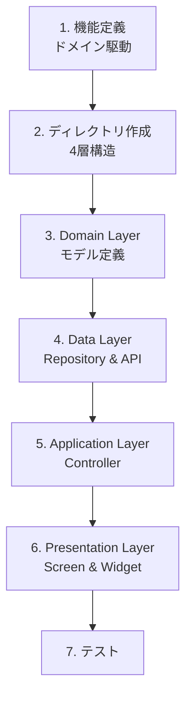

# Flutter Development Documentation

本プロジェクトのFlutter開発ドキュメントへようこそ。
このドキュメント群は、チーム全体で統一された品質と設計思想のもと、効率的に開発を進めるための指針です。

## 📚 ドキュメント一覧

### 🚀 1. 基礎・アーキテクチャ
プロジェクトの根幹となる設計思想や構造について解説します。

*   **[01_architecture.md](./01_architecture.md)**
    *   **内容**: **Feature-First (機能優先)** アーキテクチャ、4層構造（data/domain/application/presentation）、ドメイン駆動設計。
    *   **対象**: 全員必読。
    *   **重要**: 機能の定義は「ユーザーが見る画面」ではなく、「ユーザーが行うこと」に基づきます。

*   **[02_api_design.md](./02_api_design.md)**
    *   **内容**: BFF (Backend For Frontend) との連携方針、レスポンス設計、エラーハンドリング。
    *   **対象**: バックエンド連携が必要な機能を実装するエンジニア。

### 🛠 2. 環境構築・ルール
開発を始めるための準備と、コードを書く際の共通ルールです。

*   **[03_setup.md](./03_setup.md)**
    *   **内容**: 必要なライブラリの解説、セットアップコマンド、コード生成ツールの使い方。
    *   **対象**: 新規参画者、環境構築時。

*   **[04_coding_standards.md](./04_coding_standards.md)**
    *   **内容**: 命名規則、コードスタイル、**コメントの書き方**、Widget実装ルール、4層構造に対応したファイル配置。
    *   **対象**: 実装時常に参照。

*   **[05_state_management.md](./05_state_management.md)**
    *   **内容**: Riverpod (Generator) の使用方法、Providerの使い分け、非同期処理のベストプラクティス。
    *   **対象**: ロジック実装者。

### 🌊 3. 実装ワークフロー
具体的な機能追加の手順をステップバイステップで解説します。

*   **[Workflows (フォルダ)](./workflows/index.md)**
    *   **[01_new_feature.md](./workflows/01_new_feature.md)**: 新機能追加の全体フロー（4層構造の作成、ドメイン駆動設計）。
    *   **[02_data_fetching.md](./workflows/02_data_fetching.md)**: データ取得 (GET) の実装詳細（Domain → Data → Application → Presentation）。
    *   **[03_data_mutation.md](./workflows/03_data_mutation.md)**: データ更新 (POST/PUT/DELETE) の実装詳細。

---

## 💡 本ドキュメントのゴール

1.  **Uniformity (統一性)**: 誰が書いても同じ構成、同じ品質のコードになること。
2.  **Scalability (拡張性)**: 機能が増えてもメンテナンス性を損なわない設計を守ること。
3.  **Onboarding (早期戦力化)**: 新しいメンバーがこのドキュメントを読むだけで開発に着手できること。

## 📝 Feature-First の重要原則

### ドメイン駆動設計

**最重要**: 機能の分類は「ユーザーが見るもの（UI）」ではなく、「ユーザーが行うこと（ドメイン）」に基づいて行います。

#### ❌ 悪い例: UIベースの分類
```text
features/
  ├── product_list_page/
  ├── product_detail_page/
  └── cart_page/
```

#### ✅ 良い例: ドメインベースの分類
```text
features/
  ├── products/     # 商品の管理と表示（一覧・詳細含む）
  ├── cart/         # カート機能
  └── orders/       # 注文機能
```

### 4層構造

各機能フォルダ内には、以下の4つのレイヤーを配置します：

```text
lib/src/features/products/
  ├── data/         # データ層: Repository、API Client、Mock
  ├── domain/       # ドメイン層: モデル、ビジネスロジック
  ├── application/  # アプリケーション層: Controller、状態管理
  └── presentation/ # プレゼンテーション層: Screen、Widget
```

---

## 🎯 コーディング規約概略

*   **コメント**: ロジックが複雑な箇所や、意図が伝わりにくい箇所には必ず詳細なコメントを記述する（**What よりも Why**）。
*   **4層構造の厳守**: `lib/src/features/`配下の各機能は必ず4層（data/domain/application/presentation）で整理する。
*   **ドメイン駆動**: 機能の定義は「ユーザーが行うこと」に基づく。
*   **具体例**: 抽象的な説明で終わらせず、必ずコードスニペットを用いて具体例を示す。
*   **最新化**: 実装とドキュメントに乖離が生まれた場合は、速やかにドキュメントを更新する。

---

## 🔄 実装の基本フロー

新機能を追加する際の標準的な流れ：



詳細は **[01_new_feature.md](./workflows/01_new_feature.md)** を参照してください。

---

## 📖 推奨読書順序

### 新規参画者向け

1. **[01_architecture.md](./01_architecture.md)** - アーキテクチャ全体を理解
2. **[03_setup.md](./03_setup.md)** - 環境構築
3. **[04_coding_standards.md](./04_coding_standards.md)** - コーディング規約
4. **[workflows/01_new_feature.md](./workflows/01_new_feature.md)** - 実装フロー
5. **[workflows/02_data_fetching.md](./workflows/02_data_fetching.md)** - データ取得実装

### 実装時

- 機能追加: **[workflows/01_new_feature.md](./workflows/01_new_feature.md)**
- GET実装: **[workflows/02_data_fetching.md](./workflows/02_data_fetching.md)**
- POST/PUT実装: **[workflows/03_data_mutation.md](./workflows/03_data_mutation.md)**
- 規約確認: **[04_coding_standards.md](./04_coding_standards.md)**

---

## ❓ 疑問が生じたら

1. まず該当するドキュメントを参照
2. ドキュメントに記載がない場合は、チームで議論
3. 決定事項をドキュメントに反映
4. ドキュメントを常に最新の状態に保つ

**ドキュメントは生きた資料です。積極的に更新していきましょう。**
