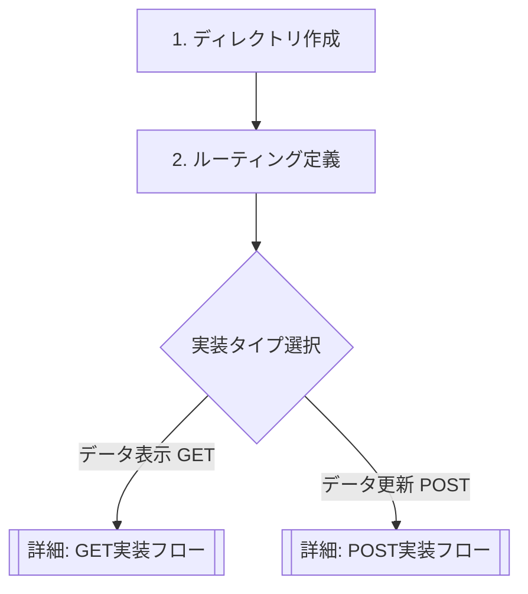

# 新機能・新画面 開発ワークフロー

本ドキュメントでは、新しい機能（Feature）および画面（Page）を追加する際の標準的な手順を解説します。
データ取得(GET)や更新(POST)の具体的な実装コードについては、各詳細ドキュメントを参照してください。

## ワークフロー全体図



*   📄 **[GET実装フロー (データ取得・表示)](./impl_get_workflow.md)**
*   📄 **[POST実装フロー (データ作成・更新)](./impl_post_workflow.md)**

---

## Step 1. ディレクトリ作成 (Scaffolding)

Feature-First アーキテクチャに従ってフォルダを作成します。

### 1-1. Featureディレクトリ
*   **Path**: `lib/features/order` (単数形)
*   **構成**: `models`, `infra`, `controllers`, `widgets`

### 1-2. Pageディレクトリ
*   **Path**: `lib/pages/order/` (単数形)
*   **ルール**: 1パス = 1ディレクトリ

---

## Step 2. ルーティング定義 (Routing)

`lib/routes/app_router.dart` に新しいパスを追加します。

```dart
GoRoute(
  path: '/orders',
  builder: (context, state) => const OrderPage(),
),
```

---

## Step 3 以降の実装

ディレクトリとルーティングの準備ができたら、目的に応じて以下の手順書に進んでください。

### データの取得・表示を行いたい場合
👉 **[impl_get_workflow.md](./impl_get_workflow.md)** を参照

1.  **Model**: レスポンスデータの定義
2.  **API**: `@GET` メソッドの定義
3.  **Repository**: 取得メソッドの実装
4.  **Controller**: `build()` でのデータ取得
5.  **UI**: `when()` での表示分け

### データの作成・更新を行いたい場合
👉 **[impl_post_workflow.md](./impl_post_workflow.md)** を参照

1.  **API**: `@POST` / `@PUT` メソッドの定義
2.  **Repository**: 更新メソッドの実装
3.  **Controller**: アクションメソッドの追加と `invalidateSelf`
4.  **UI**: イベントハンドラからの呼び出し