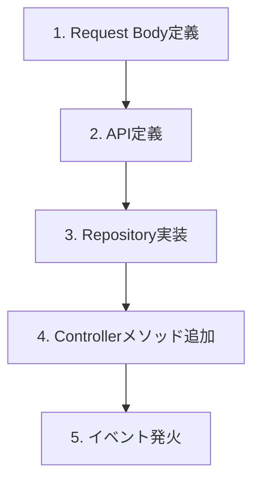

# データ作成・更新ワークフロー (POST/PUT)

サーバーにデータを送信し、作成・更新を行う手順です。
`Product` を新規作成するケースを例にします。

---

## 実装ステップ概要



---

## Step 1. リクエストボディ定義 (Model)

送信するデータの構造を定義します。
GET時のレスポンスモデル(`Product`)をそのまま使う場合と、作成専用のモデル(`CreateProductRequest`)を作る場合があります。
ここでは既存の `Product` を使う例とします。

**重要**: `@freezed` (json_serializable) が `toJson()` メソッドを自動生成するため、手動でのJSON変換コードは不要です。

---

## Step 2. APIクライアント定義 (Retrofit)

`@POST`, `@PUT`, `@DELETE` アノテーションを使用します。
引数に `@Body()` を付けることで、オブジェクトが自動的にJSON化されて送信されます。

**Path**: `lib/features/product/infra/product_api_client.dart`

```dart
@RestApi()
abstract class ProductApiClient {
  // ...

  @POST('/products')
  Future<void> createProduct(@Body() Product product);
  
  // 参考: ID指定更新の場合
  @PUT('/products/{id}')
  Future<Product> updateProduct(@Path('id') int id, @Body() Product product);
}
```

---

## Step 3. リポジトリ実装 (Repository)

**Path**: `lib/features/product/infra/product_repository.dart`

```dart
abstract class ProductRepository {
  // ...
  Future<void> createProduct(Product product);
}

class ProductRepositoryImpl implements ProductRepository {
  final ProductApiClient _api;
  ProductRepositoryImpl(this._api);

  @override
  Future<void> createProduct(Product product) {
    // 引数のproductはRetrofit内部で .toJson() され、HTTP Bodyとして送信される
    return _api.createProduct(product);
  }
}
```

---

## Step 4. コントローラー実装 (Controller)

データ更新用メソッドを追加します。
更新成功後に、一覧データを再取得(`invalidateSelf`)するパターンが一般的です。

**Path**: `lib/features/product/controllers/product_list_controller.dart`

```dart
@riverpod
class ProductListController extends _$ProductListController {
  @override
  FutureOr<List<Product>> build() {
    return ref.read(productRepositoryProvider).fetchProducts();
  }

  // アクションメソッド
  Future<void> addProduct(String name, int price) async {
    // 1. 送信データ作成
    final newProduct = Product(id: 0, name: name, price: price);

    // 2. Repository呼び出し (ここでPOSTされる)
    await ref.read(productRepositoryProvider).createProduct(newProduct);

    // 3. 成功したらリストをリフレッシュ (GETの再実行)
    ref.invalidateSelf();
    await future; // ロード完了を待つ
  }
}
```

---

## Step 5. UI実装 (Event Trigger)

ボタンなどのイベントハンドラからコントローラーのメソッドを呼び出します。

**Path**: `lib/pages/product/product_add_page.dart`

```dart
ElevatedButton(
  onPressed: () async {
    try {
      // ローディング表示などを出す場合はここでState管理
      await ref.read(productListControllerProvider.notifier)
          .addProduct('New Item', 1000);
      
      // 成功時の処理 (画面を閉じるなど)
      if (context.mounted) {
        context.pop();
        ScaffoldMessenger.of(context).showSnackBar(
          const SnackBar(content: Text('作成しました')),
        );
      }
    } catch (e) {
      // エラーハンドリング
    }
  },
  child: const Text('作成'),
)
```
