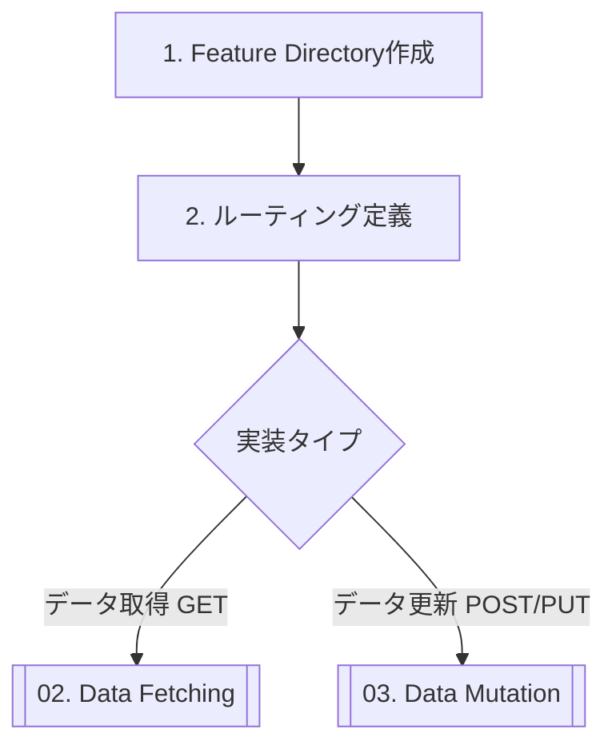

# 01. New Feature Workflow

新機能を追加する際の標準的な手順です。

## Flow Chart



---

## Step 1. Feature Directory作成

Feature-Firstアーキテクチャに従い、`lib/src/features/`配下に新しい機能フォルダを作成します。

### 原則: ドメイン駆動で機能を定義する

**重要**: 機能は「ユーザーが見る画面」ではなく、**「ユーザーが行うこと（ドメイン）」**に基づいて定義します。

#### ❌ 悪い例: UIベースの命名

```text
features/
  ├── order_list_page/      # 注文一覧ページ
  ├── order_detail_page/    # 注文詳細ページ
  └── create_order_page/    # 注文作成ページ
```

#### ✅ 良い例: ドメインベースの命名

```text
features/
  └── orders/               # 注文機能（一覧・詳細・作成すべてを含む）
```

---

## Step 2. ディレクトリ構造

新しい機能フォルダには、**4層構造**を作成します。

### 例: 注文機能 (orders) を追加する場合

```text
lib/src/features/orders/
  ├── data/                           # データ層
  │   ├── order_repository.dart       # Repository実装
  │   ├── order_api_client.dart       # API通信 (Retrofit)
  │   └── mock_order_repository.dart  # Mock実装
  │
  ├── domain/                         # ドメイン層
  │   ├── order.dart                  # ドメインモデル (Freezed)
  │   ├── order.freezed.dart          # 生成ファイル
  │   └── order.g.dart                # 生成ファイル
  │
  ├── application/                    # アプリケーション層
  │   └── order_controller.dart       # 状態管理 (Riverpod Notifier)
  │
  └── presentation/                   # プレゼンテーション層
      ├── orders_screen.dart          # 注文一覧画面
      ├── order_detail_page.dart      # 注文詳細画面
      └── widgets/
          ├── order_card.dart         # 注文カード（再利用可能）
          └── order_status_badge.dart # 注文ステータスバッジ
```

**各層の役割**:
- **data**: API通信、Repository実装、Mock
- **domain**: モデル定義、ビジネスロジック
- **application**: 状態管理、ユースケース
- **presentation**: 画面、ウィジェット

---

## Step 3. ルーティング定義

`lib/src/routing/app_router.dart` にパスを追加します。
GoRouterを使用しているため、`routes` 配列に追加します。

```dart
// lib/src/routing/app_router.dart

GoRoute(
  path: '/orders',
  name: 'orders',
  builder: (context, state) => const OrdersScreen(),
  routes: [
    // 詳細画面のネスト
    GoRoute(
      path: ':id',
      name: 'order_detail',
      builder: (context, state) {
        final id = state.pathParameters['id']!;
        return OrderDetailPage(orderId: id);
      },
    ),
  ],
),
```

**ポイント**:
- 画面はすべて`presentation/`層に配置
- URLパスと画面の対応を明確にする
- パラメータは`pathParameters`で受け取る

---

## Step 4. 実装の進め方

新機能の実装は、**下から上**（Domain → Data → Application → Presentation）の順で進めます。

### 推奨手順

1. **Domain Layer**: モデル定義
   ```dart
   // lib/src/features/orders/domain/order.dart
   @freezed
   class Order with _$Order {
     const factory Order({
       required String id,
       required String userId,
       required List<OrderItem> items,
       required double totalAmount,
       required OrderStatus status,
     }) = _Order;

     factory Order.fromJson(Map<String, dynamic> json) =>
         _$OrderFromJson(json);
   }
   ```

2. **Data Layer**: Repository & API Client
   ```dart
   // lib/src/features/orders/data/order_api_client.dart
   @RestApi()
   abstract class OrderApiClient {
     factory OrderApiClient(Dio dio) = _OrderApiClient;

     @GET('/orders')
     Future<List<Order>> fetchOrders();
   }
   ```

3. **Application Layer**: Controller
   ```dart
   // lib/src/features/orders/application/order_controller.dart
   @riverpod
   class OrderController extends _$OrderController {
     @override
     Future<List<Order>> build() async {
       final repository = ref.read(orderRepositoryProvider);
       return await repository.fetchOrders();
     }
   }
   ```

4. **Presentation Layer**: 画面
   ```dart
   // lib/src/features/orders/presentation/orders_screen.dart
   class OrdersScreen extends ConsumerWidget {
     @override
     Widget build(BuildContext context, WidgetRef ref) {
       final asyncOrders = ref.watch(orderControllerProvider);
       // UI実装
     }
   }
   ```

---

## Step 5. 次のステップ

基盤が完成したら、具体的なロジック実装に進みます。

*   **データを表示したい（GET）**
    👉 **[02. Data Fetching (GET)](./02_data_fetching.md)**

*   **データを保存・更新したい（POST/PUT）**
    👉 **[03. Data Mutation (POST/PUT)](./03_data_mutation.md)**

---

## チェックリスト

新機能追加時に確認すべき項目：

- [ ] 機能名はドメイン駆動（UIベースではない）か？
- [ ] 4層構造（data/domain/application/presentation）が作成されているか？
- [ ] ルーティングが`app_router.dart`に追加されているか？
- [ ] 画面は`presentation/`層に配置されているか？
- [ ] 共通化すべきUIコンポーネントはないか？（→ `common_widgets`へ）
- [ ] テストファイル（`test/`）も同じ構造で作成されているか？
