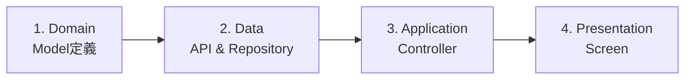

# 02. Data Fetching Workflow (GET)

サーバーからデータを取得し、画面に表示するまでの実装手順です。
`Product`（商品）一覧を取得・表示するケースを例に解説します。

---

## 実装の流れ

**Domain → Data → Application → Presentation** の順で実装します。



---

## Step 1. Domain Layer: モデル定義

APIレスポンスのJSON構造に合わせてモデルを定義します。

**ファイルパス**: `lib/src/features/products/domain/product.dart`

```dart
import 'package:freezed_annotation/freezed_annotation.dart';

part 'product.freezed.dart';
part 'product.g.dart';

@freezed
class Product with _$Product {
  const factory Product({
    required String id,
    required String title,
    required String description,
    required double price,
    String? imageUrl,
  }) = _Product;

  factory Product.fromJson(Map<String, dynamic> json) =>
      _$ProductFromJson(json);
}
```

**ポイント**:
- **Freezed**を使用してイミュータブルなモデルを定義
- JSONのキーは`snake_case`でもDart側は`camelCase`
- `build_runner`で自動生成: `dart run build_runner build`

---

## Step 2. Data Layer: API Client

Dioを使った通信インターフェースを定義します。

**ファイルパス**: `lib/src/features/products/data/product_api_client.dart`

```dart
import 'package:dio/dio.dart';
import 'package:retrofit/retrofit.dart';
import '../domain/product.dart';

part 'product_api_client.g.dart';

@RestApi()
abstract class ProductApiClient {
  factory ProductApiClient(Dio dio, {String baseUrl}) = _ProductApiClient;

  @GET('/products')
  Future<List<Product>> fetchProducts();

  @GET('/products/{id}')
  Future<Product> fetchProduct(@Path('id') String id);
}
```

**ポイント**:
- `@RestApi()`でRetrofitクライアントを定義
- `@GET`でエンドポイントを指定
- パスパラメータは`@Path()`で受け取る

---

## Step 3. Data Layer: Repository

APIクライアントを隠蔽し、Mock切り替えを可能にします。

**ファイルパス**: `lib/src/features/products/data/product_repository.dart`

```dart
import 'package:riverpod_annotation/riverpod_annotation.dart';
import 'package:your_app/src/config/env.dart';
import 'product_api_client.dart';
import 'mock_product_repository.dart';
import '../domain/product.dart';

part 'product_repository.g.dart';

// RepositoryのProvider定義
@Riverpod(keepAlive: true)
ProductRepository productRepository(ProductRepositoryRef ref) {
  // 環境変数でMock判定
  if (Env.useMock) {
    return MockProductRepository();
  }

  // Real実装
  final api = ref.read(productApiClientProvider);
  return ProductRepositoryImpl(api);
}

// 抽象クラス
abstract class ProductRepository {
  Future<List<Product>> fetchProducts();
  Future<Product> fetchProduct(String id);
}

// 実装クラス
class ProductRepositoryImpl implements ProductRepository {
  final ProductApiClient _api;

  ProductRepositoryImpl(this._api);

  @override
  Future<List<Product>> fetchProducts() async {
    try {
      return await _api.fetchProducts();
    } catch (e) {
      // 必要に応じてエラーを変換
      throw Exception('商品一覧の取得に失敗しました');
    }
  }

  @override
  Future<Product> fetchProduct(String id) async {
    try {
      return await _api.fetchProduct(id);
    } catch (e) {
      throw Exception('商品の取得に失敗しました');
    }
  }
}
```

**Mock実装例**: `lib/src/features/products/data/mock_product_repository.dart`

```dart
class MockProductRepository implements ProductRepository {
  @override
  Future<List<Product>> fetchProducts() async {
    // ダミーデータを返す
    await Future.delayed(const Duration(seconds: 1));
    return [
      const Product(
        id: '1',
        title: 'サンプル商品1',
        description: 'これはサンプルです',
        price: 1000,
      ),
      const Product(
        id: '2',
        title: 'サンプル商品2',
        description: 'これもサンプルです',
        price: 2000,
      ),
    ];
  }

  @override
  Future<Product> fetchProduct(String id) async {
    await Future.delayed(const Duration(milliseconds: 500));
    return const Product(
      id: '1',
      title: 'サンプル商品1',
      description: 'これはサンプルです',
      price: 1000,
    );
  }
}
```

---

## Step 4. Application Layer: Controller

UIの状態（Loading / Data / Error）を管理します。

**ファイルパス**: `lib/src/features/products/application/product_controller.dart`

```dart
import 'package:riverpod_annotation/riverpod_annotation.dart';
import '../domain/product.dart';
import '../data/product_repository.dart';

part 'product_controller.g.dart';

// 商品一覧Controller
@riverpod
class ProductListController extends _$ProductListController {
  @override
  Future<List<Product>> build() async {
    // 初期化時にデータを取得
    final repository = ref.read(productRepositoryProvider);
    return await repository.fetchProducts();
  }

  // 手動リフレッシュ
  Future<void> refresh() async {
    state = const AsyncLoading();
    state = await AsyncValue.guard(() async {
      final repository = ref.read(productRepositoryProvider);
      return await repository.fetchProducts();
    });
  }
}

// 商品詳細Controller
@riverpod
class ProductDetailController extends _$ProductDetailController {
  @override
  Future<Product> build(String productId) async {
    final repository = ref.read(productRepositoryProvider);
    return await repository.fetchProduct(productId);
  }
}
```

**ポイント**:
- `AsyncNotifier`を使用して非同期状態を管理
- `build()`が初期化時に自動実行される
- `AsyncValue.guard()`でエラーハンドリング

---

## Step 5. Presentation Layer: 画面実装

**ファイルパス**: `lib/src/features/products/presentation/products_screen.dart`

```dart
import 'package:flutter/material.dart';
import 'package:flutter_riverpod/flutter_riverpod.dart';
import '../application/product_controller.dart';
import 'widgets/product_card.dart';

class ProductsScreen extends ConsumerWidget {
  const ProductsScreen({super.key});

  @override
  Widget build(BuildContext context, WidgetRef ref) {
    // Controllerの状態を監視
    final asyncProducts = ref.watch(productListControllerProvider);

    return Scaffold(
      appBar: AppBar(title: const Text('商品一覧')),
      body: asyncProducts.when(
        // ✅ データ取得成功時
        data: (products) {
          if (products.isEmpty) {
            return const Center(child: Text('商品がありません'));
          }

          return RefreshIndicator(
            // スワイプで更新
            onRefresh: () async {
              await ref.read(productListControllerProvider.notifier).refresh();
            },
            child: ListView.builder(
              itemCount: products.length,
              itemBuilder: (context, index) {
                final product = products[index];
                return ProductCard(product: product);
              },
            ),
          );
        },

        // 🚨 エラー発生時
        error: (error, stackTrace) {
          return Center(
            child: Column(
              mainAxisAlignment: MainAxisAlignment.center,
              children: [
                const Icon(Icons.error, size: 64, color: Colors.red),
                const SizedBox(height: 16),
                Text('エラー: $error'),
                const SizedBox(height: 16),
                ElevatedButton(
                  onPressed: () {
                    // 再試行: Providerを再生成
                    ref.invalidate(productListControllerProvider);
                  },
                  child: const Text('再試行'),
                ),
              ],
            ),
          );
        },

        // ⏳ ロード中
        loading: () => const Center(child: CircularProgressIndicator()),
      ),
    );
  }
}
```

**Widgetコンポーネント**: `lib/src/features/products/presentation/widgets/product_card.dart`

```dart
import 'package:flutter/material.dart';
import '../../domain/product.dart';

class ProductCard extends StatelessWidget {
  final Product product;

  const ProductCard({super.key, required this.product});

  @override
  Widget build(BuildContext context) {
    return Card(
      margin: const EdgeInsets.symmetric(horizontal: 16, vertical: 8),
      child: ListTile(
        leading: product.imageUrl != null
            ? Image.network(product.imageUrl!, width: 50, height: 50, fit: BoxFit.cover)
            : const Icon(Icons.image, size: 50),
        title: Text(product.title),
        subtitle: Text(product.description),
        trailing: Text(
          '¥${product.price.toStringAsFixed(0)}',
          style: const TextStyle(fontSize: 16, fontWeight: FontWeight.bold),
        ),
        onTap: () {
          // 詳細画面へ遷移
          // context.push('/products/${product.id}');
        },
      ),
    );
  }
}
```

---

## Step 6. コード生成

Freezed, Riverpod, Retrofitの生成コードを作成します。

```bash
# コード生成
dart run build_runner build --delete-conflicting-outputs

# 監視モード（開発時推奨）
dart run build_runner watch --delete-conflicting-outputs
```

---

## まとめ

### 実装チェックリスト

- [ ] Domain Layer: モデル定義 (`product.dart`)
- [ ] Data Layer: API Client定義 (`product_api_client.dart`)
- [ ] Data Layer: Repository実装 (`product_repository.dart`)
- [ ] Data Layer: Mock実装 (`mock_product_repository.dart`)
- [ ] Application Layer: Controller実装 (`product_controller.dart`)
- [ ] Presentation Layer: 画面実装 (`products_screen.dart`)
- [ ] Presentation Layer: Widgetコンポーネント (`product_card.dart`)
- [ ] コード生成実行 (`build_runner`)

### データフロー

```
User → Screen (Presentation)
         ↓ ref.watch()
      Controller (Application)
         ↓ fetchData()
      Repository (Data)
         ↓ HTTP Request
      API Client (Data)
         ↓ Response
      Domain Model
         ↓ state更新
      Screen リビルド
```

### 次のステップ

データの更新・作成を実装する場合:
👉 **[03. Data Mutation (POST/PUT)](./03_data_mutation.md)**
