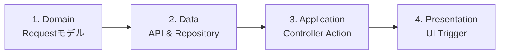

# 03. Data Mutation Workflow (POST/PUT/DELETE)

サーバーへデータを送信し、作成・更新・削除を行う際の実装手順です。
`Product`（商品）を新規作成するケースを例に解説します。

---

## 実装の流れ

**Domain → Data → Application → Presentation** の順で実装します。



---

## Step 1. Domain Layer: Requestモデル定義

送信するデータの構造を定義します。

**ファイルパス**: `lib/src/features/products/domain/create_product_request.dart`

```dart
import 'package:freezed_annotation/freezed_annotation.dart';

part 'create_product_request.freezed.dart';
part 'create_product_request.g.dart';

@freezed
class CreateProductRequest with _$CreateProductRequest {
  const factory CreateProductRequest({
    required String title,
    required String description,
    required double price,
    String? imageUrl,
  }) = _CreateProductRequest;

  factory CreateProductRequest.fromJson(Map<String, dynamic> json) =>
      _$CreateProductRequestFromJson(json);
}
```

**ポイント**:
- GET時のモデル（`Product`）と分ける（IDなどサーバー生成項目を除外）
- 作成・更新で必要なフィールドのみを含める
- バリデーションロジックもdomain層に配置可能

**更新用Requestモデル例**:

```dart
@freezed
class UpdateProductRequest with _$UpdateProductRequest {
  const factory UpdateProductRequest({
    required String id,
    String? title,
    String? description,
    double? price,
    String? imageUrl,
  }) = _UpdateProductRequest;

  factory UpdateProductRequest.fromJson(Map<String, dynamic> json) =>
      _$UpdateProductRequestFromJson(json);
}
```

---

## Step 2. Data Layer: API Client

`@POST`, `@PUT`, `@DELETE` メソッドを定義します。

**ファイルパス**: `lib/src/features/products/data/product_api_client.dart`

```dart
import 'package:dio/dio.dart';
import 'package:retrofit/retrofit.dart';
import '../domain/product.dart';
import '../domain/create_product_request.dart';
import '../domain/update_product_request.dart';

part 'product_api_client.g.dart';

@RestApi()
abstract class ProductApiClient {
  factory ProductApiClient(Dio dio, {String baseUrl}) = _ProductApiClient;

  // GET (既存)
  @GET('/products')
  Future<List<Product>> fetchProducts();

  @GET('/products/{id}')
  Future<Product> fetchProduct(@Path('id') String id);

  // POST: 新規作成
  @POST('/products')
  Future<Product> createProduct(@Body() CreateProductRequest request);

  // PUT: 更新
  @PUT('/products/{id}')
  Future<Product> updateProduct(
    @Path('id') String id,
    @Body() UpdateProductRequest request,
  );

  // DELETE: 削除
  @DELETE('/products/{id}')
  Future<void> deleteProduct(@Path('id') String id);
}
```

**ポイント**:
- `@Body()`で RequestモデルをJSONに変換して送信
- `@Path()`でURLパラメータを指定
- レスポンスは作成・更新後のモデルを返すことが多い

---

## Step 3. Data Layer: Repository

**ファイルパス**: `lib/src/features/products/data/product_repository.dart`

```dart
import 'package:riverpod_annotation/riverpod_annotation.dart';
import 'package:your_app/src/config/env.dart';
import 'product_api_client.dart';
import 'mock_product_repository.dart';
import '../domain/product.dart';
import '../domain/create_product_request.dart';
import '../domain/update_product_request.dart';

part 'product_repository.g.dart';

@Riverpod(keepAlive: true)
ProductRepository productRepository(ProductRepositoryRef ref) {
  if (Env.useMock) {
    return MockProductRepository();
  }

  final api = ref.read(productApiClientProvider);
  return ProductRepositoryImpl(api);
}

// 抽象クラス
abstract class ProductRepository {
  Future<List<Product>> fetchProducts();
  Future<Product> fetchProduct(String id);
  Future<Product> createProduct(CreateProductRequest request);
  Future<Product> updateProduct(String id, UpdateProductRequest request);
  Future<void> deleteProduct(String id);
}

// 実装クラス
class ProductRepositoryImpl implements ProductRepository {
  final ProductApiClient _api;

  ProductRepositoryImpl(this._api);

  @override
  Future<List<Product>> fetchProducts() async {
    return await _api.fetchProducts();
  }

  @override
  Future<Product> fetchProduct(String id) async {
    return await _api.fetchProduct(id);
  }

  @override
  Future<Product> createProduct(CreateProductRequest request) async {
    try {
      return await _api.createProduct(request);
    } catch (e) {
      throw Exception('商品の作成に失敗しました');
    }
  }

  @override
  Future<Product> updateProduct(String id, UpdateProductRequest request) async {
    try {
      return await _api.updateProduct(id, request);
    } catch (e) {
      throw Exception('商品の更新に失敗しました');
    }
  }

  @override
  Future<void> deleteProduct(String id) async {
    try {
      await _api.deleteProduct(id);
    } catch (e) {
      throw Exception('商品の削除に失敗しました');
    }
  }
}
```

**Mock実装例**: `lib/src/features/products/data/mock_product_repository.dart`

```dart
class MockProductRepository implements ProductRepository {
  final List<Product> _mockData = [
    const Product(id: '1', title: 'サンプル1', description: '説明1', price: 1000),
    const Product(id: '2', title: 'サンプル2', description: '説明2', price: 2000),
  ];

  @override
  Future<Product> createProduct(CreateProductRequest request) async {
    await Future.delayed(const Duration(milliseconds: 500));
    final newProduct = Product(
      id: DateTime.now().millisecondsSinceEpoch.toString(),
      title: request.title,
      description: request.description,
      price: request.price,
      imageUrl: request.imageUrl,
    );
    _mockData.add(newProduct);
    return newProduct;
  }

  @override
  Future<Product> updateProduct(String id, UpdateProductRequest request) async {
    await Future.delayed(const Duration(milliseconds: 500));
    final index = _mockData.indexWhere((p) => p.id == id);
    if (index == -1) throw Exception('Product not found');

    final updated = _mockData[index].copyWith(
      title: request.title ?? _mockData[index].title,
      description: request.description ?? _mockData[index].description,
      price: request.price ?? _mockData[index].price,
    );
    _mockData[index] = updated;
    return updated;
  }

  @override
  Future<void> deleteProduct(String id) async {
    await Future.delayed(const Duration(milliseconds: 500));
    _mockData.removeWhere((p) => p.id == id);
  }

  // 既存メソッド...
}
```

---

## Step 4. Application Layer: Controller Action

**ファイルパス**: `lib/src/features/products/application/product_controller.dart`

```dart
import 'package:riverpod_annotation/riverpod_annotation.dart';
import '../domain/product.dart';
import '../domain/create_product_request.dart';
import '../domain/update_product_request.dart';
import '../data/product_repository.dart';

part 'product_controller.g.dart';

@riverpod
class ProductListController extends _$ProductListController {
  @override
  Future<List<Product>> build() async {
    final repository = ref.read(productRepositoryProvider);
    return await repository.fetchProducts();
  }

  // ========================================
  // 作成アクション
  // ========================================
  Future<void> createProduct(CreateProductRequest request) async {
    // ローディング状態にする
    state = const AsyncLoading();

    state = await AsyncValue.guard(() async {
      final repository = ref.read(productRepositoryProvider);

      // 1. 商品を作成
      await repository.createProduct(request);

      // 2. 一覧を再取得して最新化
      return await repository.fetchProducts();
    });
  }

  // ========================================
  // 更新アクション
  // ========================================
  Future<void> updateProduct(String id, UpdateProductRequest request) async {
    state = const AsyncLoading();

    state = await AsyncValue.guard(() async {
      final repository = ref.read(productRepositoryProvider);

      await repository.updateProduct(id, request);

      // 一覧を再取得
      return await repository.fetchProducts();
    });
  }

  // ========================================
  // 削除アクション
  // ========================================
  Future<void> deleteProduct(String id) async {
    state = const AsyncLoading();

    state = await AsyncValue.guard(() async {
      final repository = ref.read(productRepositoryProvider);

      await repository.deleteProduct(id);

      // 一覧を再取得
      return await repository.fetchProducts();
    });
  }
}
```

**ポイント**:
- `AsyncValue.guard()`で例外ハンドリング
- アクション成功後に一覧を再取得（最新データを表示）
- `state`を`AsyncLoading`にすることでUI側でローディング表示可能

---

## Step 5. Presentation Layer: UI実装

### 5.1. 作成画面

**ファイルパス**: `lib/src/features/products/presentation/product_create_page.dart`

```dart
import 'package:flutter/material.dart';
import 'package:flutter_hooks/flutter_hooks.dart';
import 'package:hooks_riverpod/hooks_riverpod.dart';
import '../application/product_controller.dart';
import '../domain/create_product_request.dart';

class ProductCreatePage extends HookConsumerWidget {
  const ProductCreatePage({super.key});

  @override
  Widget build(BuildContext context, WidgetRef ref) {
    // 入力フォーム用コントローラ (flutter_hooks)
    final titleController = useTextEditingController();
    final descriptionController = useTextEditingController();
    final priceController = useTextEditingController();

    return Scaffold(
      appBar: AppBar(title: const Text('商品作成')),
      body: Padding(
        padding: const EdgeInsets.all(16),
        child: Column(
          children: [
            TextField(
              controller: titleController,
              decoration: const InputDecoration(labelText: 'タイトル'),
            ),
            const SizedBox(height: 16),
            TextField(
              controller: descriptionController,
              decoration: const InputDecoration(labelText: '説明'),
              maxLines: 3,
            ),
            const SizedBox(height: 16),
            TextField(
              controller: priceController,
              decoration: const InputDecoration(labelText: '価格'),
              keyboardType: TextInputType.number,
            ),
            const SizedBox(height: 24),

            ElevatedButton(
              onPressed: () async {
                // バリデーション
                if (titleController.text.isEmpty) {
                  ScaffoldMessenger.of(context).showSnackBar(
                    const SnackBar(content: Text('タイトルを入力してください')),
                  );
                  return;
                }

                // Requestモデル作成
                final request = CreateProductRequest(
                  title: titleController.text,
                  description: descriptionController.text,
                  price: double.tryParse(priceController.text) ?? 0,
                );

                try {
                  // Controllerのアクション実行
                  await ref
                      .read(productListControllerProvider.notifier)
                      .createProduct(request);

                  // 成功時の処理
                  if (context.mounted) {
                    Navigator.of(context).pop(); // 画面を閉じる
                    ScaffoldMessenger.of(context).showSnackBar(
                      const SnackBar(content: Text('商品を作成しました')),
                    );
                  }
                } catch (e) {
                  // エラー時
                  if (context.mounted) {
                    ScaffoldMessenger.of(context).showSnackBar(
                      SnackBar(content: Text('エラー: $e')),
                    );
                  }
                }
              },
              child: const Text('作成'),
            ),
          ],
        ),
      ),
    );
  }
}
```

### 5.2. 削除ボタン実装例

```dart
// 商品一覧画面でのスワイプ削除
ListView.builder(
  itemCount: products.length,
  itemBuilder: (context, index) {
    final product = products[index];

    return Dismissible(
      key: Key(product.id),
      direction: DismissDirection.endToStart,
      background: Container(
        color: Colors.red,
        alignment: Alignment.centerRight,
        padding: const EdgeInsets.only(right: 16),
        child: const Icon(Icons.delete, color: Colors.white),
      ),
      confirmDismiss: (direction) async {
        // 削除確認ダイアログ
        return await showDialog<bool>(
          context: context,
          builder: (context) => AlertDialog(
            title: const Text('確認'),
            content: const Text('この商品を削除しますか？'),
            actions: [
              TextButton(
                onPressed: () => Navigator.of(context).pop(false),
                child: const Text('キャンセル'),
              ),
              TextButton(
                onPressed: () => Navigator.of(context).pop(true),
                child: const Text('削除'),
              ),
            ],
          ),
        );
      },
      onDismissed: (direction) async {
        // 削除実行
        await ref
            .read(productListControllerProvider.notifier)
            .deleteProduct(product.id);

        if (context.mounted) {
          ScaffoldMessenger.of(context).showSnackBar(
            const SnackBar(content: Text('削除しました')),
          );
        }
      },
      child: ProductCard(product: product),
    );
  },
);
```

---

## Step 6. ref.listen でエラーハンドリング

アクション実行時のエラーを`ref.listen`で監視する方法もあります。

```dart
class ProductsScreen extends ConsumerWidget {
  @override
  Widget build(BuildContext context, WidgetRef ref) {
    final asyncProducts = ref.watch(productListControllerProvider);

    // Controllerの状態変化を監視
    ref.listen<AsyncValue<List<Product>>>(
      productListControllerProvider,
      (previous, next) {
        // エラー時のみ反応
        next.whenOrNull(
          error: (error, stackTrace) {
            ScaffoldMessenger.of(context).showSnackBar(
              SnackBar(content: Text('エラー: $error')),
            );
          },
        );
      },
    );

    // UI実装...
  }
}
```

---

## まとめ

### 実装チェックリスト

- [ ] Domain Layer: Requestモデル定義 (`create_product_request.dart`)
- [ ] Data Layer: API Client更新（POST/PUT/DELETE追加）
- [ ] Data Layer: Repository更新（作成・更新・削除メソッド追加）
- [ ] Data Layer: Mock実装更新
- [ ] Application Layer: Controllerにアクションメソッド追加
- [ ] Presentation Layer: 作成・更新・削除のUI実装
- [ ] コード生成実行 (`build_runner`)

### データフロー

```
User (ボタン押下)
    ↓
Presentation Layer (Form入力)
    ↓
Controller Action (createProduct/updateProduct/deleteProduct)
    ↓
Repository (POST/PUT/DELETE)
    ↓
API Client (HTTP Request)
    ↓
成功 → 一覧再取得 → state更新 → UI更新
失敗 → AsyncError → エラー表示
```

### ベストプラクティス

1. **バリデーション**: Domain Layerに配置するのが理想
2. **楽観的更新**: ローカル状態を先に更新し、失敗時にロールバック（高度）
3. **エラーハンドリング**: `ref.listen`で統一的に処理
4. **ローディング表示**: `AsyncLoading`でローディング状態を明示
5. **確認ダイアログ**: 削除など重要なアクションには確認を入れる

### 次のステップ

データ取得の実装に戻る場合:
👉 **[02. Data Fetching (GET)](./02_data_fetching.md)**
